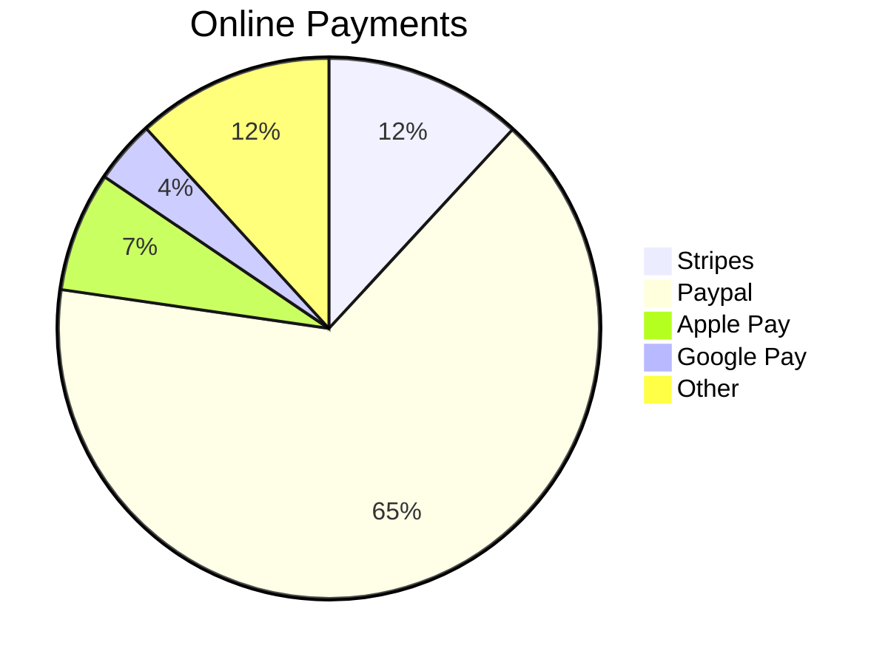

# Stripe - a fintech case study

## The mission to increase the GDP of the internet

---

### Overview

---

Stripe is a software company that allows online stores to efficiently collect payment from their consumers. The company's most note worthy angel investor is Elon Musk, who had a major hand in the creation of their competitor, PayPal. The company is currently valued at $94.4 billion. 

- **Stripe officially launched in 2011**
- **Created by Irish American brothers Patrick and John Collision, dropouts of MIT and Harvard**
- **The goal was to expand on PayPal and make it easier without restrictions and confusing interfaces. Unlike PayPal, Stripe does not directly inject itself into the checkout process. Their new method used 7 simple lines of code and their own APIs in order to deliver the best product for small businesses.**
- **The company charges 2.9% of total transaction value and 30 cent for each transaction processed. In addition to this, Stripe has also received 2.2 billion from 39 investors.**

### Business Activities:

---

- **Stripe allows merchants to accept payments with only a few lines of code on their website rather than having to work with the complex systems and integrations offered previously.**
- **The intended customers are small businesses in e-commerce. The US is home to 1.82 million online retailers.**
- **There are currently 116,866 registered companies using Stripe, and the company has claimed that 89% of all credit cards have been processed through their networks.**
- **11.85% of all online payments are done through Stripe.**
- **They utilize the advantage of speed and ease of use of their code in order to give small businesses an opportunity to compete in the same ecosystem as larger more established ones.**
- **The company utilizes a lot of common tools such as Ruby, JavaScript, HTML5, jQuery, and Google Analytics.** 

### Landscape:

---

- **The company operates under the FinTech domain of Payments & Remittances.**
- **Large trends include major increase in mobile technology, pay later services, international e-commerce, crypto (which Stripe does not currently support due to the price instability).** 
- **Other competitors in their domain include: Klarna (provides similar buy now pay later method), Pine Labs (provides similar e-commerce software), and PayPal (their inspiration).**

### Results

---

- **The company has heavily impacted the e-commerce side of business.**
- **They report to be able to increase revenue by 10% for new sellers and reduce chargebacks by 25%.**
- **Forrester, a lead global market researching company, found that the company was able to improve buyer and seller experiences and accelerate growth.**
- **The core metric to examine for companies such as Stripe is their market size for online payments. This gives insight into how much impact the product truly has.**

As seen in the pie chart, Stripe is performing relatively well. Their largest competitor, PayPal, is still a far ways away; however, the company currently holds the second largest consumer base. They have edged out ahead of Apple Pay and Google Pay combined.  

### Recommendations

---

Companies such as PayPal and Apple Pay come with their own credit cards services which allow them to reach consumers on an individual basis rather than a business just setting up their online payment methods. These cards have their own applications and are accepted in most stores around the world. Stripe has a corporate card available, which means that the technology is not far from their grasp. A cashback reward could include purchases made through Stripe systems get a certain percentage of that purchase applied to their statement as credit. 

Benefits include: 

- **The new product allows Stripe to easily expand their market into the credit realm and reach individual consumers.**
- **They are an extremely popular and trusted company, holding 12% of all online payments, so any new venture will reach audiences through word of mouth or small advertisements.**
- **A reward system with cashback would incentivize spending, which later increases revenue as the company collects 2.9% on transactions and $.30 per transaction processed through their systems.**

Technologies utilized:

- **EMV chips**

- **NFC technology**

- **APIs**

- **Smartphone application** 

These technologies allow their credit cards to be both secure and effective in a variety of markets. A platform for the app allows the company to continue their goal of keeping things simple, as it would give their consumers an easy way to track their balance, payments, and statements.

---

*Addendum*

[Business Model Zoo](https://www.businessmodelzoo.com/exemplars/stripe/#:~:text=Stripe%20makes%20money%20by%20charging,account%20in%20the%20pricing%20model)

[CB Insights](https://www.cbinsights.com/company/stripe/competitors-partners)

[Crunchbase](https://news.crunchbase.com/news/under-the-hood-a-closer-look-at-stripe-the-most-highly-valued-venture-backed-private-company-in-the-us/#:~:text=Stripe's%20business,cents%20for%20each%20payment%20transaction.)

[Enlyft](https://enlyft.com/tech/products/stripe)

[FinTech Wikipedia](https://en.wikipedia.org/wiki/Financial_technology)

[Merchant Maverick](https://www.merchantmaverick.com/how-does-stripe-work/)

[Payments Journal](https://www.paymentsjournal.com/fintech-payment-trends-in-2021-six-experts-weigh-in/)

[Privacy](https://blog.privacy.com/7-technologies-that-sparked-the-card-issuance-revolution/)

[Stripe](https://stripe.com/reports/forrester-tei-2018#:~:text=Platforms%20and%20marketplaces%20achieve%20364,new%20markets%2C%20and%20accelerate%20growth.)

[Stripe Wikipedia](https://en.wikipedia.org/wiki/Stripe_(company))

